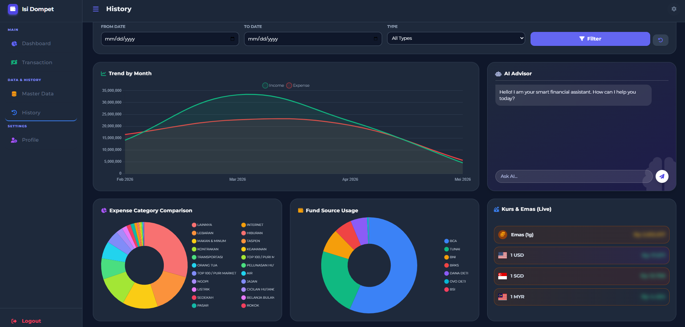

# Isi Dompet - Aplikasi Manajemen Keuangan Pribadi



**Isi Dompet** adalah aplikasi web manajemen keuangan pribadi (Personal Finance Management) yang modern, komprehensif, dan cerdas. Dibangun sepenuhnya di atas platform Google Apps Script dengan Google Sheets sebagai databasenya, aplikasi ini menawarkan solusi lengkap untuk melacak pemasukan, pengeluaran, investasi, hingga mendapatkan wawasan dari asisten AI.

---

## ✨ Fitur Utama

*   **Dashboard Interaktif**: Ringkasan kondisi finansial secara *real-time*, termasuk dana tersedia, total pengeluaran, dana terencana, dan total investasi.
*   **Visualisasi Data**: Grafik donat untuk *cashflow* bulanan dan grafik garis untuk tren transaksi 7 hari terakhir.
*   **Pencatatan Transaksi**: Fitur input yang mudah untuk mencatat **Pemasukan**, **Pengeluaran**, dan **Transfer** antar akun.
*   **Manajemen Master Data (CRUD)**: Kelola semua aset dan liabilitas Anda di satu tempat:
    *   🏦 **Bank**: Rekening bank.
    *   📱 **E-Wallet**: Dompet digital.
    *   💵 **Tunai**: Uang fisik.
    *   💎 **Investasi**: Aset investasi (saham, reksa dana, dll).
    *   🐷 **Tabungan**: Dana simpanan.
    *   🧾 **Hutang & Piutang**: Lacak dan kelola pembayaran hutang/piutang.
    *   📅 **Rencana**: Alokasikan budget untuk kebutuhan mendatang.
*   **Histori & Laporan Lengkap**:
    *   Tabel histori transaksi dengan fitur pencarian dan filter (tanggal, tipe).
    *   Grafik tren transaksi bulanan.
    *   Grafik perbandingan pengeluaran per kategori.
    *   Grafik penggunaan sumber dana.
*   **🤖 Asisten Keuangan AI**:
    *   Didukung oleh model AI **LLaMA 3.3 via Groq API** yang super cepat.
    *   Tanya apa saja tentang data keuangan Anda dan dapatkan jawaban serta saran yang relevan.
*   **Dukungan Multi-Bahasa & Multi-Mata Uang**:
    *   Tersedia dalam Bahasa Indonesia, Inggris, dan Melayu.
    *   Konversi nominal ke IDR, USD, MYR, dan SGD.
*   **Kurs Live**: Menampilkan kurs mata uang dan harga emas secara *real-time*.
*   **UI Modern & Responsif**:
    *   Desain antarmuka yang bersih dan modern menggunakan Tailwind CSS.
    *   Mode Terang (Light) dan Gelap (Dark).
    *   Fitur "Sensor Saldo" untuk privasi.
    *   Dapat diakses dengan baik di desktop maupun perangkat mobile.

---

## 🛠️ Teknologi yang Digunakan

*   **Backend**: **Google Apps Script**
*   **Database**: **Google Sheets**
*   **Frontend**: HTML, JavaScript (ES6+), Tailwind CSS
*   **Library**:
    *   [Chart.js](https://www.chartjs.org/) untuk visualisasi data.
    *   [SweetAlert2](https://sweetalert2.github.io/) untuk notifikasi dan dialog.
    *   [Font Awesome](https://fontawesome.com/) untuk ikon.
*   **API Eksternal**:
    *   [Groq API](https://groq.com/) untuk layanan AI Chat.
    *   [Currency API](https://github.com/fawazahmed0/currency-api) untuk data kurs mata uang.

## 📂 Struktur File Proyek

```
eclasp/isidompet/
├── Code.js               # Logika backend (Google Apps Script)
├── app.js                # Logika frontend (JavaScript)
├── index.html            # File HTML utama (kerangka aplikasi)
├── view_dashboard.html   # Tampilan halaman Dashboard
├── view_transaksi.html   # Tampilan halaman Input Transaksi
├── view_input.html       # Tampilan halaman Master Data
├── view_history.html     # Tampilan halaman History & Laporan
├── view_profile.html     # Tampilan halaman Profil
├── assets/
│   └── screenshot.png    # Gambar screenshot aplikasi
└── README.md             # File ini
```

---

## 📄 Lisensi

Proyek ini dilisensikan di bawah Lisensi MIT.

---

Dibuat dengan ❤️ untuk manajemen keuangan yang lebih baik.